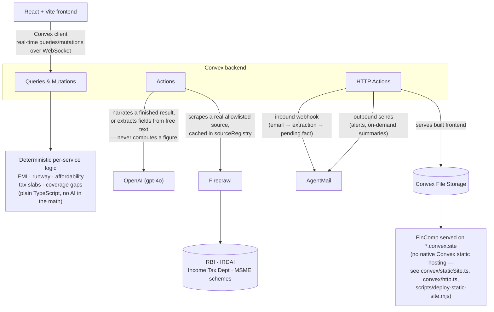

# FinComp

**One place to see what a decision really means for your household.**

## What it is


FinComp is a goal- and situation-aware financial platform for Indian
households, connecting income, debt, goals, investments, insurance, tax,
and real economic signals in one place instead of scattering them across
apps. It's built for the Convex All Gas Hackathon.

## Live demo

**[https://quixotic-dalmatian-305.convex.site](https://quixotic-dalmatian-305.convex.site)**

## The 9 services

Each service links to its own doc — what it does, how its numbers are
actually computed, and exactly where AI is used. See
[docs/services](./docs/services/README.md) for the full index.

- **[Financial Foundation](./docs/services/financial-foundation.md)** —
  See your real numbers: income, expenses, loans, and how long your
  reserves would last.
- **[Goal & Situation Planning](./docs/services/goal-situation-planning.md)** —
  Plan across years, not just today, and see how your plans interact.
- **[Loan & Debt Resilience](./docs/services/loan-debt-resilience.md)** —
  Know if a loan actually fits, and how to pay it off faster.
- **[Side-Income & Business Planning](./docs/services/side-income-business.md)** —
  Explore a job or business idea that realistically fits your time and money.
- **[Investment & Risk Planning](./docs/services/investment-risk.md)** —
  Understand what you can afford to set aside — never what to buy.
- **[Insurance, Protection & Financial Rights](./docs/services/insurance-protection.md)** —
  Know what you're covered for, and where you might be exposed.
- **[Tax Planning](./docs/services/tax-planning.md)** — See your
  deductions and compare regimes — no filing, just clarity.
- **[Government, Economic & Livelihood Intelligence](./docs/services/government-economic-intelligence.md)** —
  We watch for real changes that could affect your job, business, or plans.
- **[Income Resilience](./docs/services/income-resilience.md)** — The
  full picture: how exposed your household really is, and what to do
  about it.

## Tech stack

- **[Convex](https://convex.dev)** — backend, real-time data, and auth
  (via Convex Auth).
- **OpenAI** — narration and extraction only, never calculation: turning
  finished, deterministic results into plain language, and pulling
  structured facts out of free text/documents.
- **[Firecrawl](https://firecrawl.dev)** — real sourced data: RBI
  benchmark rates, IRDAI insurance guidelines, Income Tax Department
  slabs, and MSME/government schemes, scraped and cached, never
  fabricated.
- **AgentMail** — inbound document extraction via email (forward a bill
  or statement, it gets parsed into a pending fact for you to confirm),
  plus proactive outbound alerts and on-demand summaries.

## Core design principle

**Every calculation is deterministic. AI only narrates, extracts, and
explains — it never invents a number, a rate, or financial advice.**
Every service's actual math (EMI, runway, affordability, tax slabs,
compounding, coverage gaps) is plain TypeScript, computed the same way
every time from the household's own data and, where relevant, a real
scraped source. The AI layer is handed the finished result and turns it
into plain language, or pulls structured fields out of unstructured text
(a document, an email, a free-text description) — it is never the thing
deciding what the numbers are.

## Architecture flow



## Running locally

```
npm install
npx convex dev
npm run dev
```

## Full build log

The complete, evidence-based development history — every service, every
verification pass, every bug found and fixed, in chronological order —
lives in [hackathon.md](./hackathon.md).

## License

MIT — see [LICENSE.txt](./LICENSE.txt).
