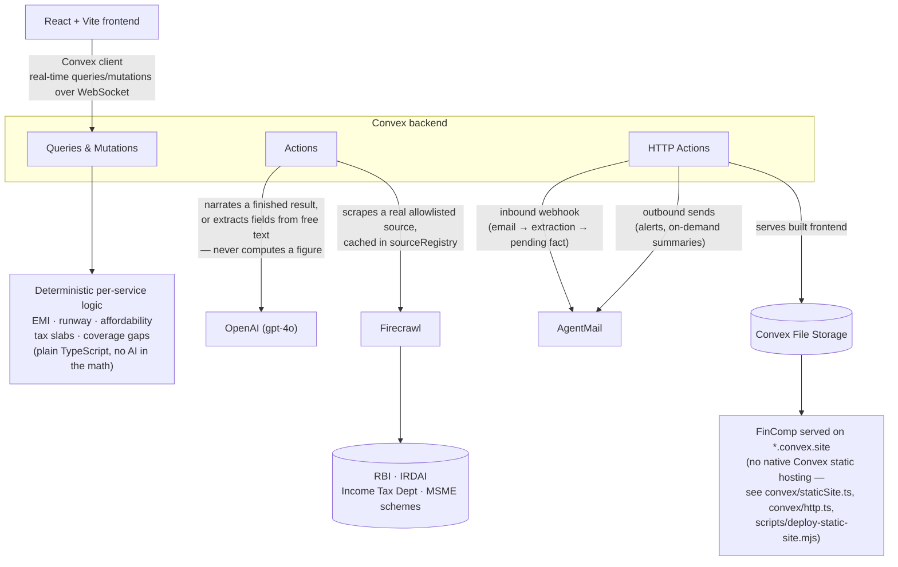

# FinComp

**One household context. Connected financial decisions.**

FinComp is a household economic-resilience platform for Indian families.
It helps people understand how changes in income, debt, goals, taxes,
insurance, investments, and livelihood affect one another — not as
isolated calculators, but as one connected financial life.


> Most financial tools answer one question in isolation. FinComp helps a
> household understand how one change affects everything else.

Losing income doesn't affect only "income." It changes loan
affordability, emergency runway, goals, investments, insurance needs,
taxes, and whether side income is needed. FinComp keeps one household
context and lets specialist services react to the same confirmed change.

Built for the Convex All Gas Hackathon.

## Live demo

**[https://quixotic-dalmatian-305.convex.site](https://quixotic-dalmatian-305.convex.site)**

All 9 services are built and verified end-to-end against the real dev
deployment — see [hackathon.md](./hackathon.md) for the evidence behind
every claim in this README. Production is live, but its environment
variables (AgentMail/Firecrawl/OpenAI keys, auth's `SITE_URL`) haven't
been reconfirmed since the production push — until that's verified, the
AI-extraction, sourced-data, and email features may not fully work on
the *live* URL even though every one of them is proven working on dev.

## Why I built it

A household's financial decisions do not happen separately.

A job loss changes loan affordability. A new loan changes the amount
available for goals and investments. A tax decision changes monthly cash
flow. Missing insurance can turn a health event into a debt problem. A
side-income plan may improve resilience, but only if it fits the
household's available time, capital, and responsibilities.

Today, people often manage these questions across different apps,
spreadsheets, documents, websites, and advisers. They repeatedly enter
the same information, while each tool sees only one part of their life.

I built FinComp to give a household one shared financial context and
show the consequences of a decision across connected areas.

## How FinComp is different

FinComp is not another budgeting app, loan calculator, tax calculator,
or investment recommender.

Its difference is coordination:

- Enter a confirmed household change once.
- Recalculate the affected financial state deterministically.
- Show which plans and services became outdated.
- Explain the consequences in plain language.
- Preserve the source, assumptions, history, and user confirmation.
- Never silently turn an AI extraction into financial truth.

For example, if dependable income stops, FinComp can update the
household's runway, flag debt pressure, identify affected goals, reduce
safe investment capacity, and surface the need for a recovery or
side-income plan — see [a full walkthrough below](#example-when-income-stops).

## The connected service model

Every service below is **built and verified** against the real dev
deployment — not a mockup or a roadmap item. Each links to its own doc:
what it does, exactly how its numbers are computed, and precisely where
AI is used. See [docs/services](./docs/services/README.md) for the full
index.

| Service | Daily-life question it answers |
| --- | --- |
| [Financial Foundation](./docs/services/financial-foundation.md) | What comes in, what goes out, what do we owe, and how long would our reserves last? |
| [Goal & Situation Planning](./docs/services/goal-situation-planning.md) | Can our plans coexist, and what changes if our situation changes? |
| [Loan & Debt Resilience](./docs/services/loan-debt-resilience.md) | Can we afford this loan, and can existing debt be repaid or restructured more safely? |
| [Side-Income & Business Planning](./docs/services/side-income-business.md) | What additional work or business can fit our time, money, location, and target income? |
| [Investment & Risk Planning](./docs/services/investment-risk.md) | How much can we responsibly set aside after essential obligations and protection? |
| [Insurance, Protection & Financial Rights](./docs/services/insurance-protection.md) | What is covered, what is exposed, and what terms or rights should we understand? |
| [Tax Planning](./docs/services/tax-planning.md) | Which deductions or regime may fit the household, based on deterministic calculations? |
| [Government, Economic & Livelihood Intelligence](./docs/services/government-economic-intelligence.md) | Which verified policy, scheme, rate, or economic change could affect our plans? |
| [Income Resilience](./docs/services/income-resilience.md) | If income changes, how prepared is the whole household, and which actions matter first? |

### Shared intelligence layer: Document Intelligence

Not a tenth tab — a capability every service above builds on. Bills,
statements, agreements, and emails (forwarded via AgentMail) or uploaded
photos/PDFs can be converted into pending structured facts across any
Financial Foundation category (income, expense, obligation, asset,
insurance). Extracted information never changes the household's real
financial state until the user reviews and confirms it — see
`convex/documentIntelligence.ts` / `convex/extractedFacts.ts`.

## Core design principle

**Every calculation is deterministic. AI only narrates, extracts, and
explains — it never invents a number, a rate, or financial advice.**
Every service's actual math (EMI, runway, affordability, tax slabs,
compounding, coverage gaps) is plain TypeScript, computed the same way
every time from the household's own data and, where relevant, a real
scraped source. The AI layer is handed the finished result and turns it
into plain language, or pulls structured fields out of unstructured text
(a document, an email, a free-text description) — it is never the thing
deciding what the numbers are.

## Sponsor technology, through real workflows

### Convex: the reactive household state

Convex is the operating backbone of FinComp — not only a database.

It stores household financial state, runs deterministic calculations,
tracks revisions, preserves analysis history, schedules background work
(daily crons for Government/Economic Intelligence and Income
Resilience), and pushes updated results to the interface in real time.

When confirmed household data changes, `households.stateRevision`
changes. Cached analyses are keyed on that revision, so a stale result
is recomputed automatically rather than silently going out of date.
Convex also serves FinComp's own built frontend directly from this
deployment's `*.convex.site` domain via a custom HTTP Action + File
Storage implementation (`convex/staticSite.ts`, `convex/http.ts`) —
Convex has no built-in static-hosting product, so this closes that gap
from real primitives instead.

### Firecrawl: current evidence, not model memory

Financial rules and public information change over time. Firecrawl
retrieves information from allowlisted, feature-specific pages —
RBI's benchmark repo rate, IRDAI's health-insurance portability
regulations, the Income Tax Department's slab and deduction pages, and
targeted government/MSME scheme searches. This is not a general crawl of
"every government source" — each integration scrapes a specific real
page for a specific feature, and only what's been actually built and
verified is listed here.

FinComp stores source snapshots (`sourceRegistry`/`sourceSnapshots`)
with retrieval dates and provenance, cached (1–60 days depending on the
feature) rather than re-scraped on every call. Values are parsed out of
the real scraped text deterministically — regex/table parsing, never
AI — and shown as labelled context, never silently substituted into a
calculation.

### AgentMail: financial information through email

A user can forward a bill, statement, or financial document to the
FinComp inbox. AgentMail delivers the email through a signed webhook;
FinComp verifies the signature, prevents duplicate processing (a dedup
guard confirmed against a real event delivered twice), extracts
candidate facts, and asks the user to confirm them before anything
touches their real financial data. Verified with real inbound mail —
two genuine emails sent from a real Gmail account were found in
AgentMail's own delivered-message record, not a log.

AgentMail also delivers requested summaries and proactive household
alerts (e.g. Government/Economic Intelligence's daily sweep, Income
Resilience's tier-drop alert) without requiring the user to keep
checking the app. Verified with real outbound sends — confirmed via a
live Amazon SES message ID and a "sent" delivery status read back from
AgentMail, not assumed from the enqueue call.

### OpenAI: interpretation without control of the numbers

OpenAI extracts structured candidate facts from documents and free text,
and turns completed calculations into understandable explanations.

It does not calculate EMI, runway, affordability, tax, compounding,
coverage gaps, or financial thresholds. Those values come from
deterministic TypeScript functions. AI-derived facts remain pending
until a human confirms them.

## Example: when income stops

1. The household records that a dependable income source has stopped.
2. Convex updates the household state and revision.
3. [Financial Foundation](./docs/services/financial-foundation.md) recalculates emergency runway.
4. [Loan & Debt Resilience](./docs/services/loan-debt-resilience.md) reevaluates monthly debt pressure.
5. Goal plans depending on that income become stale ([Goal & Situation Planning](./docs/services/goal-situation-planning.md)).
6. [Investment & Risk Planning](./docs/services/investment-risk.md) reconsiders capacity after essential obligations.
7. [Side-Income & Business Planning](./docs/services/side-income-business.md) can use the resulting monthly shortfall as a target.
8. [Income Resilience](./docs/services/income-resilience.md) combines the effects into prioritized actions.
9. The household can request a plain-language summary through AgentMail.

This is why FinComp needs to be one connected household context, not
nine unrelated tabs.

## Architecture flow



## Running locally

```
npm install
npx convex dev
npm run dev
```

## Full build log

The complete, evidence-based development history — every service, every
verification pass, every bug found and fixed, in chronological order —
lives in [hackathon.md](./hackathon.md).

## License

MIT — see [LICENSE.txt](./LICENSE.txt).
